## Table of Contents

- [Introduction](#introduction)
- [Tech Stack](#tech-stack)
- [Backend Overview](#backend-overview)
- [Frontend Overview](#frontend-overview)
- [Installation](#installation)
    - [Backend Setup](#backend-setup)
    - [Frontend Setup](#frontend-setup)

- [Environmental Variable Setup](#environmental-variable-setup)
- [Mongodb Setup](#mongodb-setup)
- [Running the Application](#running-the-application)

---

## Introduction

The TechJob platform is designed to display and manage job postings for the tech industry. The backend, built with
Spring Boot, uses MongoDB for data storage. The frontend, developed using React, presents these job posts to users.


---

## Tech Stack

- **Backend**: Spring Boot
- **Frontend**: React
- **Database**: MongoDB (Cloud - MongoDB Atlas)
- **Libraries/Tools**:
    - Spring Data MongoDB
    - React Hooks
    - Axios for API calls

---

## Backend Overview

The backend of this project is built using **Spring Boot**. It handles job post data and exposes REST APIs for the
frontend to consume. The data is stored in **MongoDB**, which is hosted on **MongoDB Atlas**.

Key components of the backend:

- **MongoDB**: Cloud-based NoSQL database used to store job posts.
- **Spring Boot**: Handles RESTful endpoints for CRUD operations on job posts.
- **Spring Data MongoDB**: Manages data access for MongoDB.
- **Output**

    - All Post End Point
      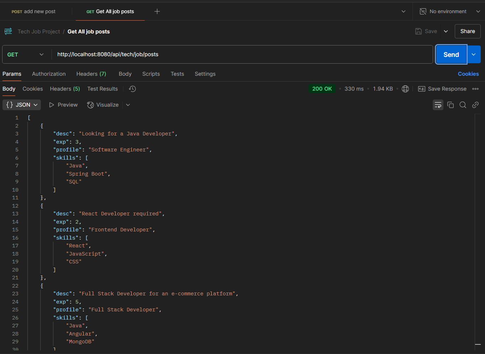

    - Adding Job Post End point
      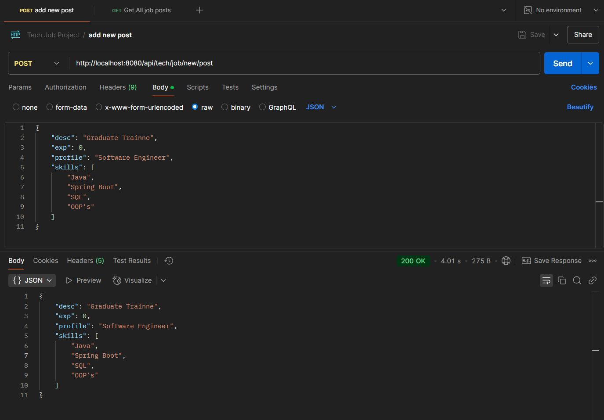

    - delete Post By id (if post **not** exists) End Point
      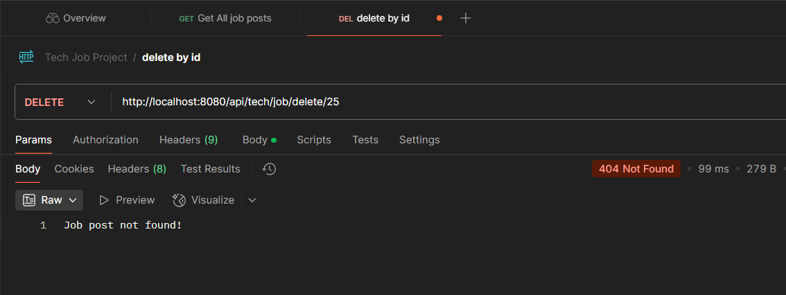

    - delete Post By id (if post exists) End point
      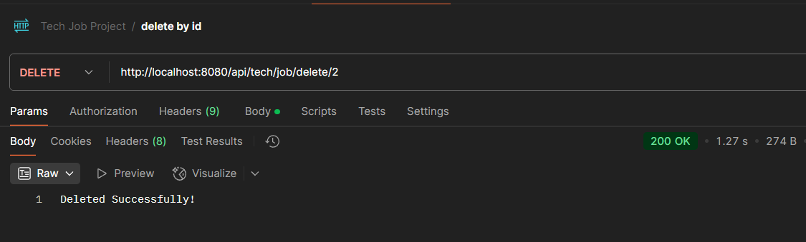

    - Update Post (if exists) End Point
      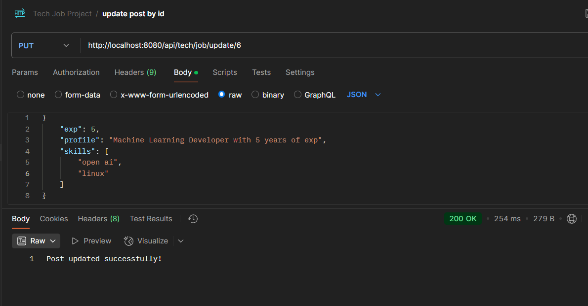

    - Update Post (if **not** exists) End point
      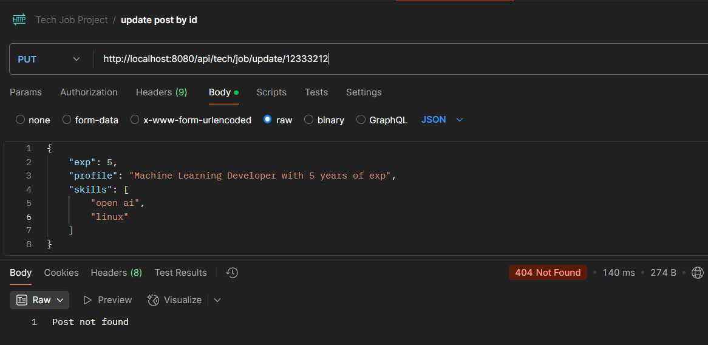

---

## Frontend Overview

The frontend is built with **React**. It communicates with the backend through **Axios** to retrieve job posts and
display them to the user. The React app is designed with components that handle:

- Fetching job posts from the backend.
- Displaying job details, including descriptions, required skills, and experience.
- Allowing users to filter job posts.

---

## Installation

### Backend Setup

1. Clone the backend repository:
   git clone https://github.com/suraj-khot-19/TechJob-SpringBoot.git


2. Navigate to the project directory:
   cd TechJob-SpringBoot

3. Build and run the Spring Boot application:
   mvn clean install
   mvn spring-boot:run

### Frontend Setup

1. Clone the frontend repository:
   git clone https://github.com/suraj-khot-19/TechJob-React.git


2. Navigate to the project directory:
   cd TechJob-React

3. Install the required dependencies:
   npm install

4. Start the React app:
   npm start

---

## Environmental Variable Setup

1. Add .env file in root of **TechJob-SpringBoot** directory
    - like this as shown in image(Also need to configure IntelliJ IDE Configuration)
    ```
   .env ==>
   
    DATASOURCE_URL=here
    DATABASE_NAME=here
    ```
   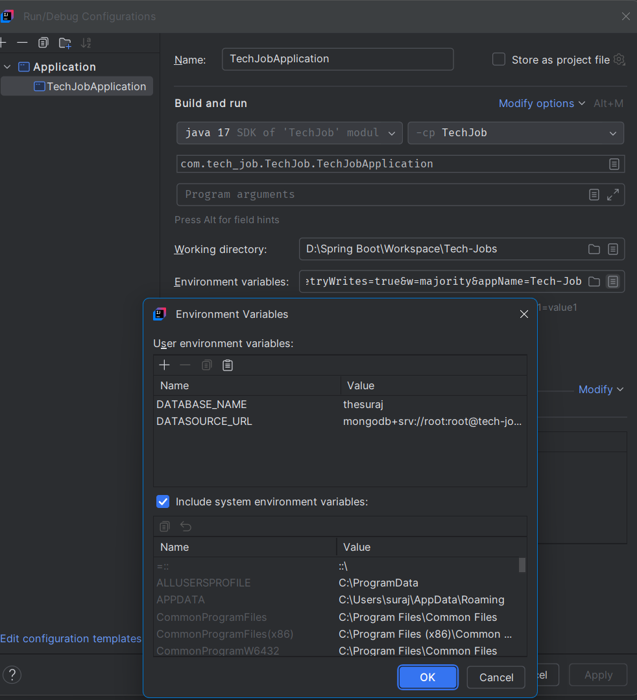

   **Do not forget to add .env in .gitignore file**

---

## Mongodb Setup

- mongodb database and document setup
  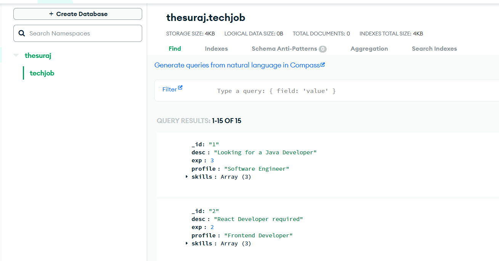
- add custom feilds in it
    ```
    [
    { "_id": "1", "desc": "Looking for a Java Developer", "exp": 3, "profile": "Software Engineer", "skills": ["Java", "Spring Boot", "SQL"] },
    { "_id": "2", "desc": "React Developer required", "exp": 2, "profile": "Frontend Developer", "skills": ["React", "JavaScript", "CSS"] },
    { "_id": "3", "desc": "Full Stack Developer for an e-commerce platform", "exp": 5, "profile": "Full Stack Developer", "skills": ["Java", "Angular", "MongoDB"] },
    { "_id": "4", "desc": "Backend Developer (Node.js)", "exp": 4, "profile": "Backend Developer", "skills": ["Node.js", "Express", "MongoDB"] },
    { "_id": "5", "desc": "Software Engineer (C++)", "exp": 2, "profile": "Software Engineer", "skills": ["C++", "Algorithms", "Data Structures"] },
    { "_id": "6", "desc": "Machine Learning Engineer", "exp": 3, "profile": "Data Scientist", "skills": ["Python", "TensorFlow", "Machine Learning"] },
    { "_id": "7", "desc": "DevOps Engineer", "exp": 4, "profile": "DevOps", "skills": ["Docker", "Kubernetes", "AWS"] },
    { "_id": "8", "desc": "UI/UX Designer", "exp": 3, "profile": "Designer", "skills": ["Figma", "UI Design", "Prototyping"] },
    { "_id": "9", "desc": "QA Engineer", "exp": 2, "profile": "Quality Assurance", "skills": ["Test Automation", "Selenium", "Jenkins"] },
    { "_id": "10", "desc": "iOS Developer", "exp": 3, "profile": "Mobile Developer", "skills": ["Swift", "Objective-C", "Xcode"] },
    { "_id": "11", "desc": "Android Developer", "exp": 3, "profile": "Mobile Developer", "skills": ["Kotlin", "Android SDK", "Firebase"] },
    { "_id": "12", "desc": "Cloud Solutions Architect", "exp": 6, "profile": "Cloud Architect", "skills": ["AWS", "Azure", "Terraform"] },
    { "_id": "13", "desc": "Blockchain Developer", "exp": 2, "profile": "Software Engineer", "skills": ["Blockchain", "Solidity", "Ethereum"] },
    { "_id": "14", "desc": "Cybersecurity Analyst", "exp": 4, "profile": "Security Analyst", "skills": ["Network Security", "Firewalls", "Penetration Testing"] },
    { "_id": "15", "desc": "Product Manager", "exp": 5, "profile": "Management", "skills": ["Agile", "Scrum", "Product Strategy"] }
    ]
    ```
- for search feature follow this steps

    1. click on create a search index
       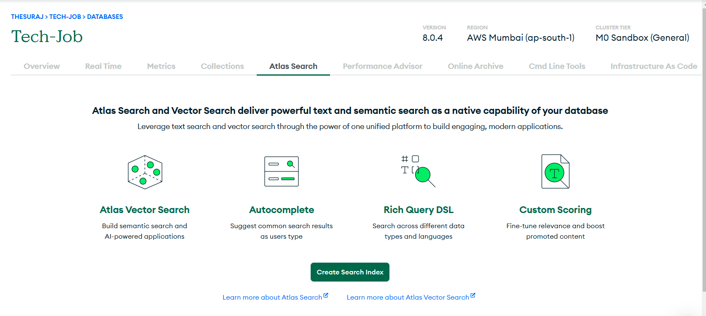
    2. click on visual editor
       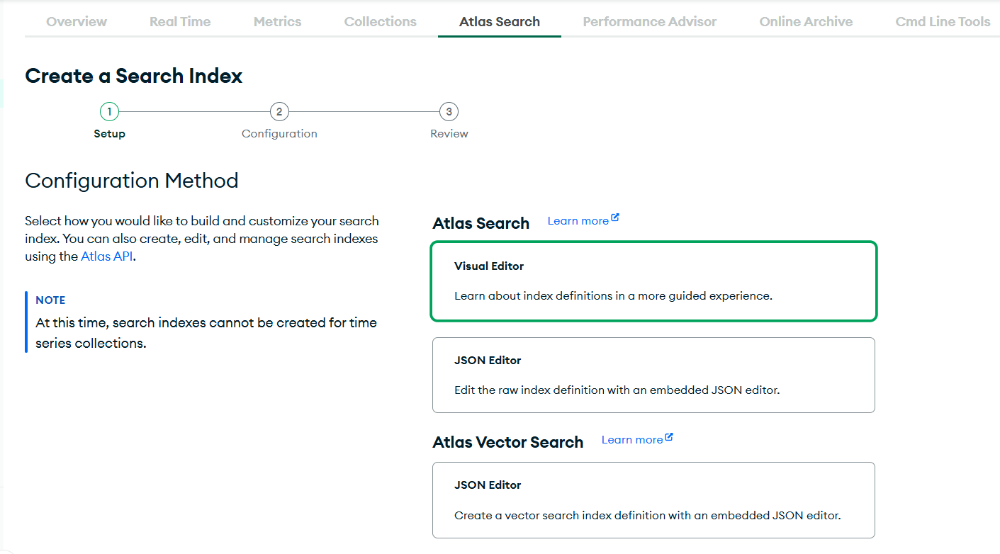
    3. name it wrt database and document name
       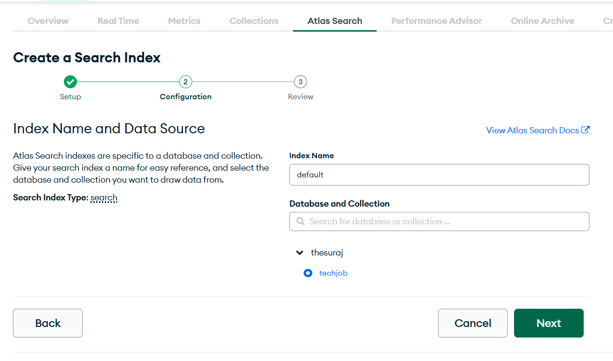

- **Now you are ready with search feature**
- creating dummy aggregation pipeline to get a code from mongodb itself
    1. Open aggregation tab
       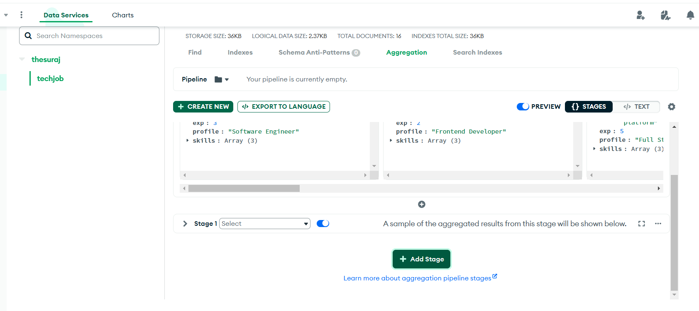
    2. stage for search
       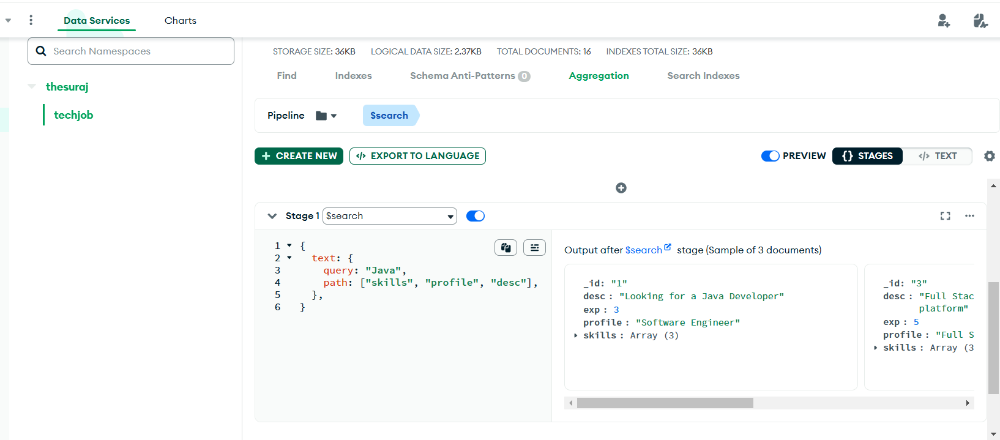
    3. stage for sort
       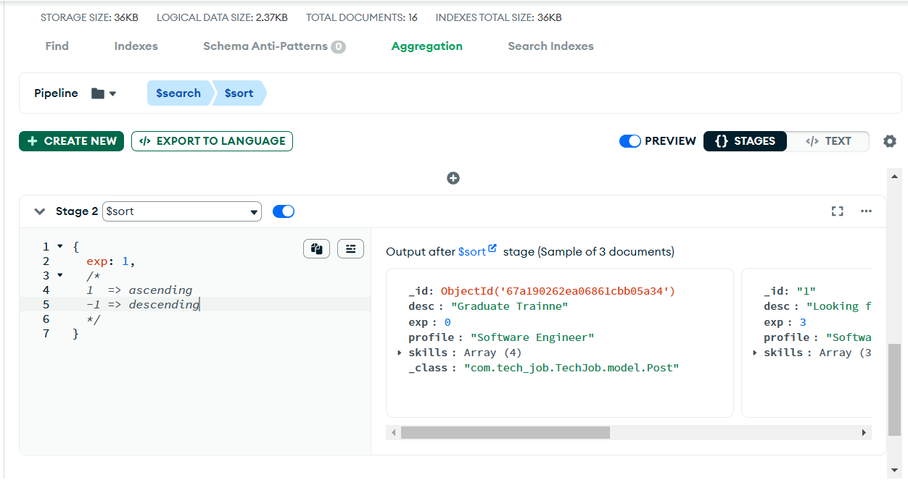
    4. stage for limit the posts
       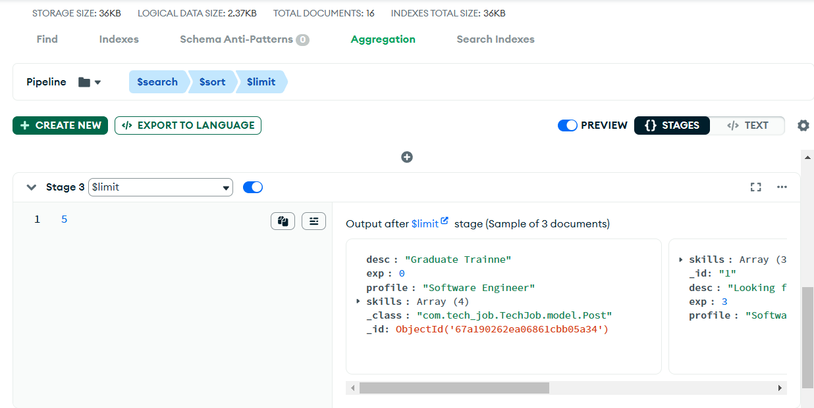
    5. now click on explore to language to get a java code
       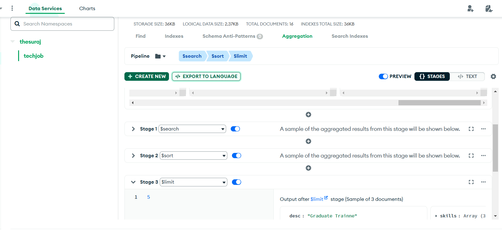
    6. java code
       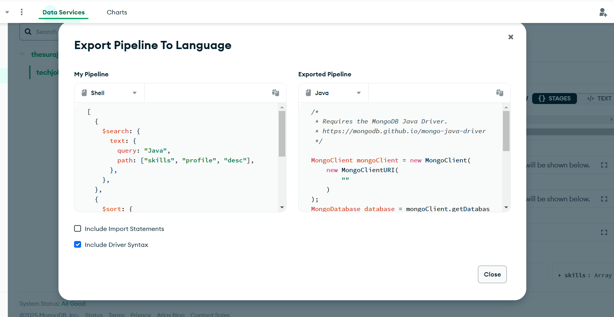
    7. now output with endpoint
       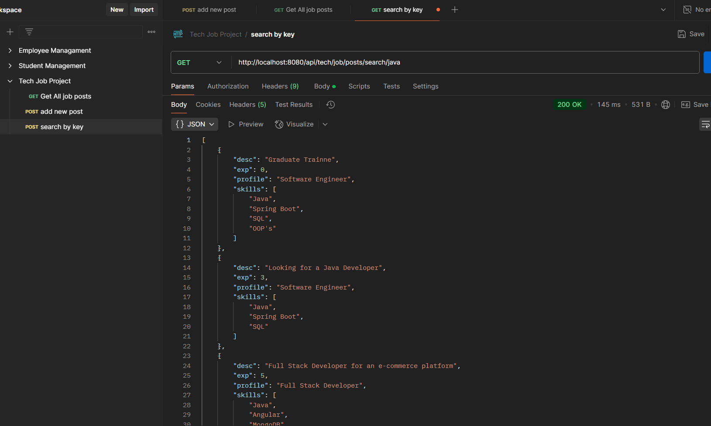

---
## Running the Application

1. **Backend**: The backend will be running on http://localhost:8080.
2. **Frontend**: The frontend will be running on http://localhost:3000.

Make sure to update the MongoDB URI in the backend's configuration file with your MongoDB Atlas credentials.
